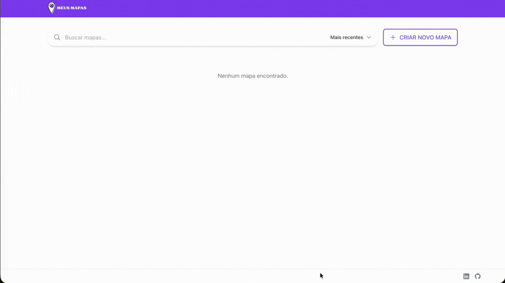
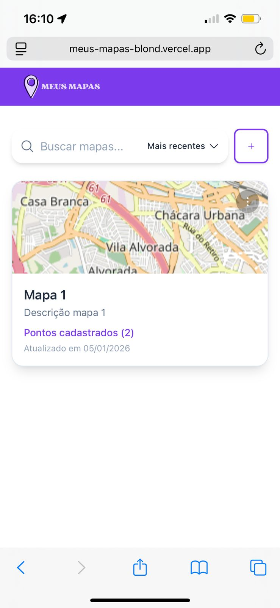
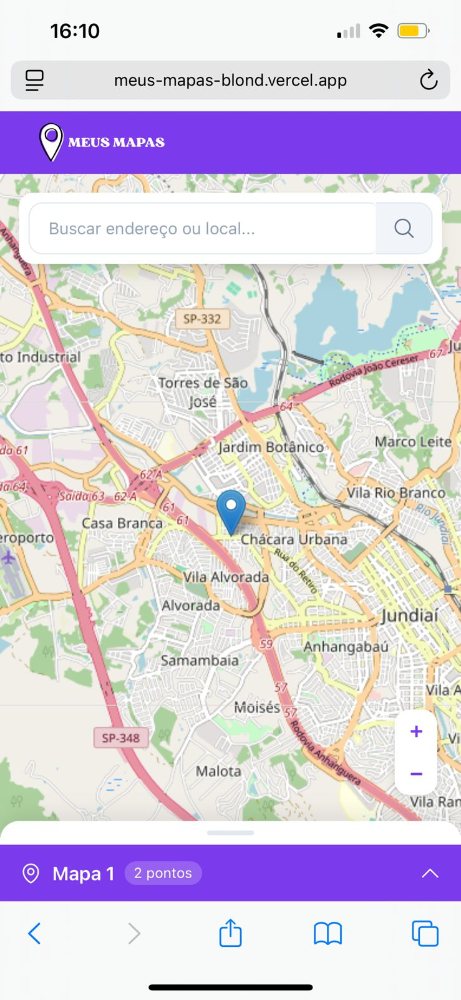

# Meus Mapas

[](https://github.com/katerine-dev/meus-mapas/actions/workflows/tests.yml)
[](https://opensource.org/licenses/MIT)

Aplicação web para criar e gerenciar mapas personalizados com pontos georreferenciados.

> **Projeto** desenvolvido para demonstrar habilidades em desenvolvimento full-stack com Next.js, PostgreSQL e React.

**[Ver aplicação ao vivo na Vercel](https://meus-mapas-blond.vercel.app/)**

---

## Pré-Requisitos

Antes de começar, você precisa ter instalado:

- [Node.js 20+ (inclui NPM 10+)](https://nodejs.org/)
- [Docker Desktop (inclui Docker Engine 24+ e Docker Compose 2.0+)](https://docs.docker.com/desktop)

## Executando a aplicação localmente

#### 1. Clone o repositório

```bash
git clone https://github.com/seu-usuario/meus-mapas.git
cd meus-mapas
```

#### 2. Instale as dependências

```bash
npm install
```

#### 3. Configure as variáveis de ambiente

```bash
# Copie o arquivo de exemplo
cp .env.example .env.local
```

#### 4. Inicie o serviço do banco de dados

```bash
# Inicia o container PostgreSQL em background
npm run db:up

# Verifique se o container está rodando
docker ps

# Aguarde o banco estar pronto (healthcheck)
npm run db:logs
# Procure por: "database system is ready to accept connections"
```

#### 5. Execute as migrações

```bash
npm run migrations:migrate
```

#### 6. Inicie o servidor de desenvolvimento

```bash
npm run dev
```

#### 7. Acesse a aplicação

**Abra no navegador:** [http://localhost:3000](http://localhost:3000)

---

## Testes

O projeto possui dois tipos de testes: **API** (backend) e **Componentes** (frontend).

Certifique-se de que o banco está rodando:

```bash
npm run db:up
```

Execute todos os testes:

```bash
npm run test:all
```

Execute os testes da API:

```bash
npm run test:api
```

```

O setup automático (vitest.setup.ts) cria o banco de teste e executa as migrações.
```

Execute os testes do Front End:

```bash
npm run test:spa
```

## Desenvolvimento

```bash
npm run dev          # Inicia servidor de desenvolvimento
npm run build        # Build de produção
npm run start        # Inicia servidor de produção
```

## Lint e Formatação

```bash
npm run lint         # Verifica problemas de lint
npm run lint:fix     # Corrige problemas automaticamente
npm run format       # Formata todo o código
npm run format:check # Verifica formatação
```

## Banco de Dados

```bash
npm run db:up        # Inicia container PostgreSQL
npm run db:down      # Para o container (mantém dados)
npm run db:clean     # Para e remove dados (CUIDADO!)
npm run db:logs      # Mostra logs do container
```

## Migrações

```bash
npm run migrations:create <NOME>   # Cria nova migração
npm run migrations:migrate         # Executa migrações pendentes
```

## Decisões Técnicas

### Aplicação

**Next.js 16 (App Router)** foi escolhido como framework principal por oferecer como integração com React 'de fábrica', arquivos estáticos servidos automaticamente, CORS configurado automaticamente etc

### Banco de Dados

#### Servidor

**PostgreSQL**: Foi escolhido por ser open source, ativamente mantido e oferecer suporte nativo a tipos geográficos (tipo `POINT`). A extensão PostGIS para operações geoespaciais avançadas pode ser adicionada futuramente se necessário.

#### Biblioteca

**node-postgres**: Optei por não usar ORM para ter controle total sobre as queries e facilitar debugging (vejo exatamente o SQL executado). SQL puro também é mais universal e possui documentação abundante.

#### Migrações

**node-pg-migrate**: Ferramenta simples de migrações que usa SQL puro, e possui uma api que pode ser chamada via TypeScript nos testes para auxiliar com as migrações.

#### API

A API da aplicação foi desenvolvida seguindo os padrões REST. Cada operação utiliza o método HTTP adequado e retorna o status correto.

### Frontend

**Tailwind CSS**: Já vem integrado com Next.js, e contém várias classes utilitárias que ajudam no desenvolvimento.

**Heroicons**: Biblioteca de ícones do mesmo time do Tailwind.

**Identidade visual**: O projeto foi baseado nas cores da NerdMonster

**Leaflet + OpenStreetMap**: Mapas interativos open source. O `OpenStreetMap` possui uma API para gerar previews que foi usada nesse projeto.

**Design responsivo**: A aplicação possui design responsivo e componentes específicos para mobile e desktop.

### Validação

**Zod** foi escolhido para validação de dados por:

- Mensagens de erro customizáveis em português
- Flexibilidade ao definir os schemas de validação

### Testes

O projeto possui dois tipos de testes:

**Testes de API (integração)**:

- Usam banco de dados separado definido em `.env.test`
- `vitest.setup.ts` cria o banco e executa migrações antes dos testes.
- Exercitam tanto o fluxo principal quanto os casos de erro, garantindo os `status code` apropriados para cada caso.
- Cada teste limpa os dados antes da execução com `beforeEach` para garantir isolamento. Isso também possibilita verificar o banco depois dos testes.
- A biblioteca `faker.js` é utilizada para gerar dados aleatórios e únicos.
- Rodam sequencialmente para facilitar o gerenciamento dos dados de testes no banco.

**Testes de Componentes (frontend)**:

- Usam Happy DOM (ambiente de navegador simulado).
- Rodam em paralelo (mais rápido).

**Testes de Validação**:

Os schemas do Zod possuem cobertura extensiva de testes, validando cada parâmetro e suas possíveis violações. Em um projeto real, essa quantidade de testes para schemas de validação pode não ser ideal, manter tantos testes adiciona um peso na manutenção do código. Aqui foram incluídos como exercício para demonstrar conhecimento.

### Estrutura de Pastas

O projeto segue a estrutura do **App Router** do Next.js 16:

| Pasta             | Responsabilidade                                             |
| ----------------- | ------------------------------------------------------------ |
| `app/`            | Raiz do App Router - páginas, API e componentes              |
| `app/api/`        | API Routes (backend) - endpoints REST                        |
| `app/api/db/`     | Camada de dados - queries SQL e conexão com PostgreSQL       |
| `app/components/` | Componentes React organizados por domínio (ui, maps, points) |
| `app/constants/`  | Constantes, mensagens de erro e configurações                |
| `app/model/`      | Tipos e interfaces TypeScript                                |
| `app/services/`   | Funções que encapsulam chamadas fetch à API                  |
| `app/validation/` | Schemas Zod para validação de dados                          |
| `lib/`            | Utilitários compartilhados (formatação, helpers de teste)    |
| `migrations/`     | Arquivos SQL de migração do banco de dados                   |
| `docs/`           | Documentação, screenshots e assets do README                 |

## Demo



### Capturas de Tela

<div align="center">
  
  &nbsp;&nbsp;&nbsp;
  
</div>

---

## Deploy

### Vercel

O projeto está configurado para deploy na Vercel com PostgreSQL (Neon) com integração Github, assim que uma nova versão é commitada no branch main, um novo deploy acontece.

---

## Possíveis Melhorias

Sugestões para evolução futura do projeto:

### Funcionalidades

- [ ] Autenticação de usuários (Sign-up, Sign-in, esqueci minha senha).
- [ ] Autorização de usuários.
- [ ] Paginação dos resultados, no momento todos os mapas e pontos estão sendo retornados sem limites no banco dados.
- [ ] Quebrar componentes muito grandes em componentes menores, como por exemplo o `MapPage`.
- [ ] Swagger através do Zod.
